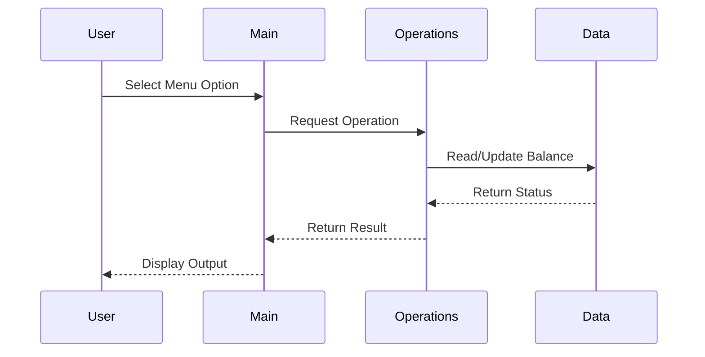

# Mergington High School Legacy Accounting System

## Overview
This document describes the legacy COBOL accounting system used for managing student fees, cafeteria accounts, and school supplies purchases.

## Key Functions & Business Rules
- **main.cob**: User interface and menu options (view student balance, process payment, record purchase, exit).
- **operations.cob**: Business logic for student account operations.
- **data.cob**: Storage of student account balances.

## Data Flow Diagram

